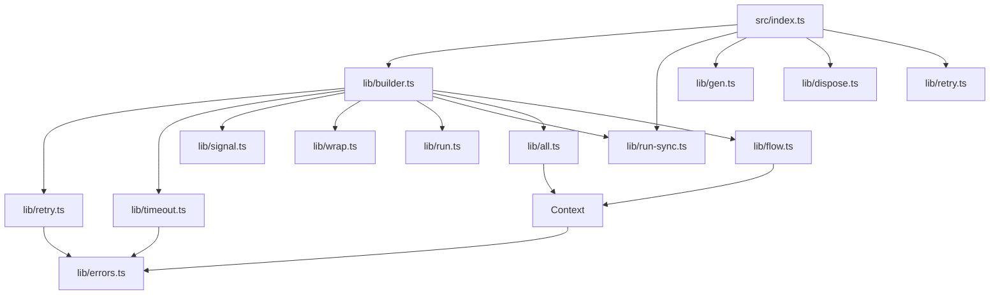
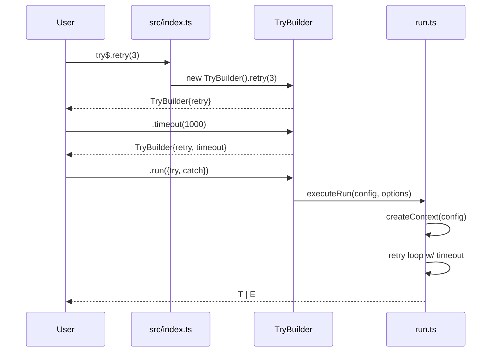
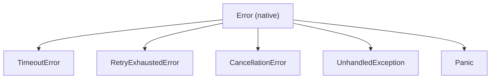

# `hardtry` Design Document

## Overview

`hardtry` is a TypeScript library that provides structured, composable error
handling for sync and async functions. It uses a fluent builder pattern to configure
retry, timeout, abort signal, and middleware before executing a function with
typed error mapping.

Users import the library as a namespace:

```ts
import * as try$ from "hardtry"
```

## Normative Spec (v1)

This section is the single source of truth for v1 behavior. If examples in
other docs differ, this section wins.

- API surface is `retry`, `timeout`, `signal`, `wrap`, `run`, `runSync`,
  `all`, `allSettled`, `flow`, `gen`, `dispose`, and `retryOptions`.
- v1 exposes `run` only (no `runPromise`).
- Naming in docs and examples is always `try$`.
- `run` supports sync and async user functions. If `try` and `catch` are sync,
  the result is sync. If either is async, the result is a `Promise`.
- Retry `limit` includes the first attempt (`retry(3)` means up to 3 total
  attempts).
- `retry(number)` uses constant backoff behavior.
- `retry({ ... })` requires an explicit `backoff` field.
- v1 timeout scope is `total` only and covers the full execution window
  (attempts, backoff waits, and `catch` execution).
- `wrap` runs around the full run execution (not per attempt).
- Control errors (`Panic`, abort, timeout) are never retried.

### Failure Precedence

When multiple failure conditions race, result resolution uses this order:

| Priority (high -> low) | Outcome              |
| ---------------------- | -------------------- |
| 1                      | `Panic`              |
| 2                      | `CancellationError`  |
| 3                      | `TimeoutError`       |
| 4                      | mapped `catch` error |
| 5                      | `UnhandledException` |

`Panic` is only possible when a `catch` handler exists and throws.

### Error Codes and Cause

All framework errors expose:

- `code` with stable machine values:
  - `EXEC_CANCELLED`
  - `EXEC_TIMEOUT`
  - `EXEC_RETRY_EXHAUSTED`
  - `EXEC_UNHANDLED_EXCEPTION`
  - `EXEC_PANIC`
- `cause` preserving the original underlying value/error.

## Architecture

The library is organized around an **immutable fluent builder** that accumulates
configuration, then delegates to executor modules for the actual work.

```
src/
  index.ts               # Public API surface: thin re-export layer
  lib/
    types.ts             # Shared TypeScript types and interfaces
    errors.ts            # Custom error classes
    run-sync.ts          # sync execution APIs: top-level runSync() + executeRunSync()
    builder.ts           # Fluent builder chain
    retry.ts             # Retry logic, backoff strategies, retryOptions()
    timeout.ts           # Timeout scoping (total)
    signal.ts            # External AbortSignal integration
    run.ts               # run() terminal execution with try/catch mapping
    gen.ts               # Generator-based composition
    dispose.ts           # Disposer with Symbol.asyncDispose
    all.ts               # all() / allSettled() parallel execution
    flow.ts              # Task orchestration with $exit
    wrap.ts              # Middleware/extensibility
  __tests__/
    builder.test.ts
    retry.test.ts
    timeout.test.ts
    signal.test.ts
    run.test.ts
    gen.test.ts
    dispose.test.ts
    all.test.ts
    flow.test.ts
    wrap.test.ts
```

### Module Dependency Graph



### Request Flow

For any call like `try$.retry(3).timeout(1000).run({...})`:



## Builder Pattern

### BuilderConfig

The builder accumulates an immutable configuration object:

```ts
interface BuilderConfig {
  retry?: RetryPolicy
  timeout?: TimeoutPolicy
  signals?: AbortSignal[]
  wraps?: WrapFn[]
}
```

### TryBuilder

Each chainable method returns a **new** builder instance. Terminal methods
delegate to their respective execution modules.

```ts
class TryBuilder {
  readonly #config: BuilderConfig

  constructor(config: BuilderConfig = {}) {
    this.#config = config
  }

  // Chainable config methods (return new builder)

  retry(policy: RetryOptions): TryBuilder {
    return new TryBuilder({
      ...this.#config,
      retry: normalizeRetryPolicy(policy),
    })
  }

  timeout(options: TimeoutOptions): TryBuilder {
    return new TryBuilder({
      ...this.#config,
      timeout: normalizeTimeoutOptions(options),
    })
  }

  signal(signal: AbortSignal): TryBuilder {
    return new TryBuilder({
      ...this.#config,
      signals: [...(this.#config.signals ?? []), signal],
    })
  }

  wrap(fn: WrapFn): TryBuilder {
    return new TryBuilder({
      ...this.#config,
      wraps: [...(this.#config.wraps ?? []), fn],
    })
  }

  // Terminal methods (execute using accumulated config)

  run<T, E>(options: RunOptions<T, E>) {
    return executeRun(this.#config, options)
  }

  all<T extends TaskMap>(tasks: T) {
    return executeAll(this.#config, tasks)
  }

  allSettled<T extends TaskMap>(tasks: T) {
    return executeAllSettled(this.#config, tasks)
  }

  flow<T extends TaskMap>(tasks: T) {
    return executeFlow(this.#config, tasks)
  }
}
```

Config methods use last-write-wins semantics, except `wrap` which is additive
(appends to a list to form a middleware chain).

### Public API Surface (src/index.ts)

`src/index.ts` is a thin re-export layer with no logic. It creates a default
immutable `TryBuilder` instance and delegates to it so the namespace functions
mirror the builder:

```ts
import { TryBuilder } from "./lib/builder"
import { executeGen } from "./lib/gen"
import { dispose } from "./lib/dispose"

export { retryOptions } from "./lib/retry"

const root = new TryBuilder()

// Chainable entry points -- return a builder
export const retry: TryBuilder["retry"] = root.retry.bind(root)
export const timeout: TryBuilder["timeout"] = root.timeout.bind(root)
export const signal: TryBuilder["signal"] = root.signal.bind(root)
export const wrap: TryBuilder["wrap"] = root.wrap.bind(root)

// Terminal entry points -- execute with empty config
export const run: TryBuilder["run"] = root.run.bind(root)
export const all: TryBuilder["all"] = root.all.bind(root)
export const allSettled: TryBuilder["allSettled"] = root.allSettled.bind(root)
export const flow: TryBuilder["flow"] = root.flow.bind(root)

// Standalone functions (not part of builder chain)
export const gen = executeGen
export { dispose }
```

This enables both usage styles:

```ts
try$.retry(3).timeout(1000).signal(signal).run({ ... })
const policy = try$.retryOptions({ limit: 3, delayMs: 300, backoff: "exponential" })
try$.retry(policy).run({ ... })
try$.run({ ... })
try$.gen(function* (use) { ... })
try$.dispose()
```

`runSync` is intentionally exposed in two forms:

- Top-level `try$.runSync(...)` (from `lib/run-sync.ts`): no builder config,
  no `TryCtx`, and no retry/timeout/signal/wrap features.
- Chainable `try$.wrap(...).runSync(...)` (via `WrappedRunBuilder`): executes
  with accumulated wraps and uses `executeRunSync(config, input)`.

Chainable `runSync` limitations:

- It is only available on the sync-capable wrapped branch.
- Once the chain enters async-only mode (for example after
  `.retry(...)`, `.timeout(...)`, or `.signal(...)`), only `.run(...)` is
  available.
- It throws `Panic` when the `try` function (or mapped `catch`) returns a
  promise, and when the configured retry policy requires async behavior.

## Error Model

All custom errors extend `Error` and preserve the original error as `cause`.

| Error                 | When                                                            |
| --------------------- | --------------------------------------------------------------- |
| `TimeoutError`        | Timeout expires (total scope)                                   |
| `RetryExhaustedError` | All retry attempts have been exhausted                          |
| `CancellationError`   | The provided `AbortSignal` fires                                |
| `UnhandledException`  | The `try` function throws and no `catch` handler was provided   |
| `Panic`               | The `catch` handler itself throws -- an unrecoverable situation |

### Error Hierarchy



`UnhandledException` wraps the original thrown value so the caller gets a typed,
inspectable error instead of an unknown. `Panic` signals a bug in the error
handling code itself and should never be caught in normal application flow.

## Module Responsibilities

### lib/types.ts

All shared TypeScript types and interfaces:

- `TryCtx` -- context passed to `try` functions (carries `signal`, retry
  metadata)
- `RunOptions<T, E>` --
  `{ try: (ctx: TryCtx) => MaybePromise<T>, catch: (e: unknown) => MaybePromise<E> }`
- `RetryPolicy` -- object form `{ limit, delayMs, backoff }` and shorthand
  `number` (constant backoff)
- `TimeoutOptions` -- `{ ms, scope: "total" }` in v1
- `WrapFn` -- signature for wrap middleware
- `FlowExit<T>` -- branded type for flow exit values
- `AllContext` / `FlowContext` -- `this`-context types with `$result`, `$signal`,
  `$disposer`, `$exit`

### lib/errors.ts

Custom error classes as described in the error model above.

### lib/run-sync.ts

Sync execution entry points:

- `runSync(...)`: top-level sync helper with no builder config.
- `executeRunSync(config, input)`: internal sync terminal used by
  chainable `runSync` on wrapped builders.

Behavior differences:

- Top-level `runSync` is context-free and returns `T | E | UnhandledException`.
- Chainable `runSync` runs against builder config and can return configured
  control errors (`CancellationError`, `TimeoutError`, `RetryExhaustedError`)
  in addition to mapped/unhandled results.
- Both forms enforce sync-only semantics and throw `Panic` if promise-like
  values are returned where sync values are required.

### lib/retry.ts

- `retryOptions()` factory for creating reusable policies
- Internal retry loop with constant and exponential backoff strategies
- Respects abort signals between retry attempts
- Normalizes shorthand (`3`) to full policy
  (`{ limit: 3, delayMs: 0, backoff: "constant" }`)
- Object policy form must include `backoff` explicitly

### lib/timeout.ts

- **Total-scoped** timeout: wraps entire execution including retries, backoff,
  and `catch`
- Creates an internal `AbortController` that races with the timeout
- Normalizes shorthand (`1000`) to full options
  (`{ ms: 1000, scope: "total" }`)

### lib/signal.ts

- Wires an external `AbortSignal` into the internal `AbortController`
- Propagates abort to all child operations
- Cleans up listeners when execution completes

### lib/run.ts

The core execution engine behind `run()`:

1. Creates a `TryCtx` from the builder config
2. Applies wrap middleware chain (if any)
3. Enters the retry loop (if configured)
4. Sets up timeout (if configured)
5. Calls the user's `try` function with the context
6. On error: calls `catch` to map user-function errors, or returns
   `UnhandledException` if no `catch` handler was provided
7. If `catch` throws: throws `Panic`

Execution rules:

- `run` has two call forms:
  - object form: `run({ try, catch })`
  - function form: `run(tryFn)` where missing `catch` implies
    `UnhandledException` mapping on user throws
- If `.signal(...)` is configured, `CancellationError` is part of the possible
  result union.
- `catch` can be async; timeout still applies to its execution.
- `catch` receives the original thrown user value for user-function failures.
  Framework control errors bypass `catch`.

### lib/gen.ts

Generator-based composition for unwrapping results:

```ts
const value = try$.gen(function* (use) {
  const user = yield* use(getUser("123"))
  const project = yield* use(getProject(user.id))
  return project
})
// value is Project | UserNotFound | ProjectNotFound
```

`use()` yields the value on success or short-circuits the generator on error,
accumulating error types in the return union.

### lib/dispose.ts

Resource disposal using `Symbol.asyncDispose`:

```ts
await using disposer = try$.dispose()
const conn = await connectDb()
disposer.use(conn)
disposer.defer(() => console.log("cleanup"))
```

- `dispose()` returns a disposer implementing `Symbol.asyncDispose`
- `.use(resource)` registers a disposable resource for cleanup
- `.defer(fn)` registers an arbitrary cleanup callback
- Disposal runs in reverse registration order
- Uses `AsyncDisposableStack` as the cleanup primitive
- If one cleanup throws, remaining cleanups still run and cleanup failures are
  aggregated

### lib/all.ts

`Promise.all` / `Promise.allSettled` alternatives with richer context:

- Named tasks with `this.$result` for inter-task dependency resolution
- `this.$signal` for abort signal access
- `this.$disposer` for resource cleanup registration
- `all()` fails fast on first error; `allSettled()` waits for all

### lib/flow.ts

Task orchestration with early exit:

- `this.$exit(value)` throws internally to interrupt the flow
- `this.$result` for accessing prior task results
- `this.$signal` for abort signal access
- Return type is a union of all `$exit()` return types, extracted via
  `FlowExit<T>` branded type
- Early `$exit` still triggers registered cleanup deterministically via
  `AsyncDisposableStack`

### lib/wrap.ts

Middleware system for extensibility:

```ts
try$
  .wrap(span("fetchUser"))
  .wrap(logTiming())
  .run(...)
```

- Wrap functions receive `TryCtx` and compose into a middleware chain
- Access to retry metadata: `ctx.retry.attempt`
- Wraps execute around full run execution (not per attempt)

## Implementation Order

Building bottom-up to minimize rework:

1. `lib/types.ts` + `lib/errors.ts` -- foundation types
2. `lib/run-sync.ts` -- sync execution (`runSync` + `executeRunSync`)
3. `lib/run.ts` -- basic `run()` without retry/timeout
4. `lib/retry.ts` -- retry logic + `retryOptions()`
5. `lib/timeout.ts` -- timeout logic
6. `lib/signal.ts` -- abort signal wiring
7. `lib/builder.ts` -- fluent chain wiring it all together
8. `lib/wrap.ts` -- middleware
9. `lib/gen.ts` -- generator composition
10. `lib/dispose.ts` -- disposer
11. `lib/all.ts` -- parallel execution
12. `lib/flow.ts` -- task orchestration
13. `index.ts` -- wire public re-exports
